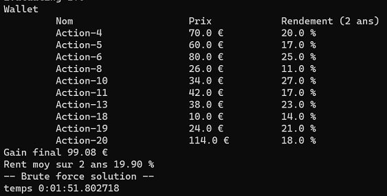
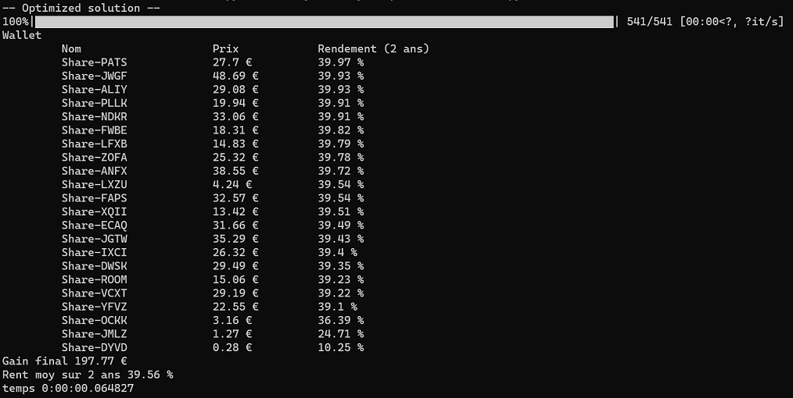

# OpenClassrooms: Projet 7 - Résolvez des problèmes en utilisant des algorithmes en Python 


*Ce projet à pour but la manipulation, la compréhension des mécanismes de constructions des algorithmes ainsi que l'importance de la notion de complexité.*

## Mise en situation: 

AlgoInvest&Trade, doit fournir à ses clients, pour un montant d’investissement donné, le meilleur choix d’actions, en fonction de leur rentabilité en % sur deux ans. 

  Un Algorithme de **Brute-Force** est demandé sur un jeu de **20 actions**. Puis un algorithme **optimisé** sur 2 jeux de **1000 actions**.

*Un jeu de résultats sur les set 1000 actions, est communiqué par l'entreprise, afin d'effectuer une comparaison vis à vis l'algorithme optimisé que nous aurons produit*
    
## Mise en place du projet: 

Pré-requis: se placer depuis le terminal dans le dossier où l'on exécute le script:

Avant toute chose on clone le répository git:

```bash
git clone https://github.com/Anthony-landry/P7-AlgoInvest-Trade
```

Une fois le projet cloné on crée et on active l'environnement virtuel:

```bash
python -m venv env
```

suivi de:

Pour Windows :
```bash
source env/bin/activate.bat
```
Pour Linux :
```bash
source env/bin/activate
```

Puis on lance l'installation des modules nécessaires au fonctionnement du script:

```bash
pip install -r requirements.txt
```

Il n'y a plus qu'à exécuter les scripts:

```bash
#"exécutera l'algo de brute force sur le set de 20 actions contenu dans le dossier data"
python brutefoce.py    
```



```bash
#"exécutera l'algo optimisé dit glouton, sur les set de 1000 actions." 
python optimized.py    
```



Si vous voulez changer le fichier .csv : 

1°) mettre votre fichier .csv dans le dossier data.


2°) changer les lignes suivantes dans le code de l'applications, em mettant le nom de votre fichier.

## Brute force : 

- Ligne 4 : FICHIER = "test_shares.csv"

## Optimized

- Ligne 5 FICHIER = "dataset2_Python+P7.csv"


## Le dossier "data" contient:
*  Un fichier .csv nommé : dataset1_Python+P7.csv.
*  Un fichier .csv nommé : dataset2_Python+P7.csv.
*  Un fichier .csv nommé : test_shares.csv
